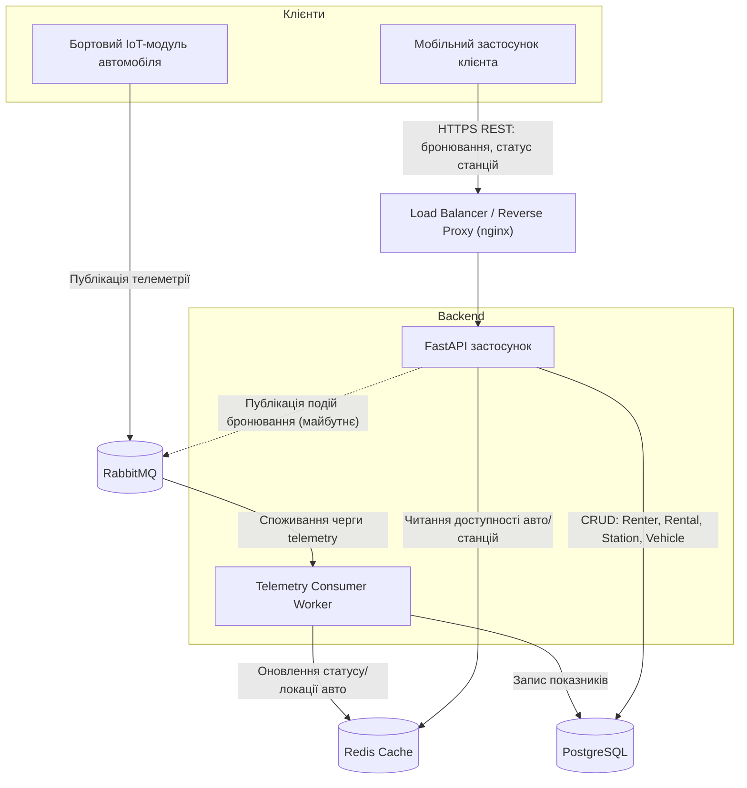

# Fleet Management System (Каршерінг)

## Обґрунтування вибору предметної області

Обрана предметна область — **Fleet Management з IoT-телеметрією** (варіант №13), реалізована на прикладі **станційного каршерінгу**: компанія володіє парком автомобілів, які клієнти орендують на короткий термін, забираючи та повертаючи авто на фіксованих станціях.

Цей напрямок цікавий поєднанням реального бізнес-кейсу (сервіси на кшталт станційного каршерінгу) з технічно складним навантаженням — безперервним потоком телеметрії від автомобілів і конкурентним доступом до обмеженої кількості авто/місць на популярних станціях, що дає простір для практики роботи з чергами повідомлень та подієво-керованою архітектурою.

### Ключові сутності

- **Vehicle** — автомобіль парку: держномер, модель, статус (available / rented / maintenance), поточна станція.
- **Station** — фіксована станція видачі/повернення: адреса, місткість, кількість вільних місць.
- **Renter** — клієнт, що орендує авто: ім'я, номер посвідчення, історія оренд.
- **Rental** — оренда/бронювання: клієнт, авто, станція старту та фінішу, час початку/кінця, статус.
- **TelemetryReading** — показник телеметрії з датчиків авто: координати, рівень пального/заряду, статус замка, часова мітка.

### Сценарій навантаження

1. **Безперервний потік телеметрії**: кожен автомобіль парку регулярно надсилає координати, рівень пального/заряду та статус замка. Ці дані йдуть через **RabbitMQ**, щоб згладити пікове навантаження запису в базу даних і не блокувати основний API.
2. **Конкурентний доступ (race condition)**: у пікові години кілька клієнтів можуть одночасно намагатися забронювати останнє вільне авто на популярній станції — це вимагає коректної обробки конкурентних транзакцій при створенні `Rental`.

## Архітектура системи



### Компоненти та потоки даних

1. **Клієнти:**
   - *Мобільний застосунок* — клієнт каршерінгу: пошук вільних авто на станціях, бронювання, оренда.
   - *Бортовий IoT-модуль* — вбудований в кожен автомобіль пристрій, що постійно публікує телеметрію (координати, рівень пального/заряду, статус замка).

2. **Load Balancer / Reverse Proxy** — розподіляє вхідні HTTP-запити між кількома інстансами FastAPI-застосунку, забезпечуючи горизонтальне масштабування бекенду під пікове навантаження (наприклад, ранкові години пік бронювань).

3. **Backend (FastAPI застосунок)** — обробляє REST-запити клієнтів: реєстрація/автентифікація, пошук доступних авто, створення `Rental`. Створення оренди виконується в межах транзакції БД з блокуванням рядка (`SELECT ... FOR UPDATE`) на записі `Vehicle`/`Station`, щоб уникнути подвійного бронювання одного авто кількома клієнтами одночасно.

4. **RabbitMQ (Message Broker)** — приймає безперервний потік повідомлень телеметрії від тисяч бортових модулів, згладжуючи пікові сплески запису і розв'язуючи публікацію даних (сенсори) зі споживанням (Worker) у часі.

5. **Telemetry Consumer Worker** — окремий процес, що споживає чергу телеметрії з RabbitMQ, зберігає історичні показники в PostgreSQL та оновлює "гарячий" стан (поточна локація/статус авто) у Redis-кеші.

6. **Redis Cache** — зберігає часто запитувані, швидкозмінні дані (поточна доступність авто на станції, останні координати), щоб API не звертався до PostgreSQL при кожному запиті пошуку авто.

7. **PostgreSQL** — основне реляційне сховище сутностей `Vehicle`, `Station`, `Renter`, `Rental` та історії `TelemetryReading`.

## Статичний аналіз якості коду (SonarQube)

Локальний SonarQube Community Edition піднімається через Docker Compose:

```powershell
docker compose -f config/docker-compose.yml up -d sonarqube
```

Дашборд: http://localhost:9000 (проєкт `fleet-management`).

Токен сканера генерується один раз у `http://localhost:9000/account/security`.

Запуск сканування (вручну, коли потрібно перевірити поточний стан коду):

```powershell
docker run --rm `
    -e SONAR_HOST_URL="http://host.docker.internal:9000" `
    -e SONAR_TOKEN="<твій токен>" `
    -v "${PWD}:/usr/src" `
    -w /usr/src `
    sonarsource/sonar-scanner-cli
```

Результат — у Quality Gate на дашборді проєкту.