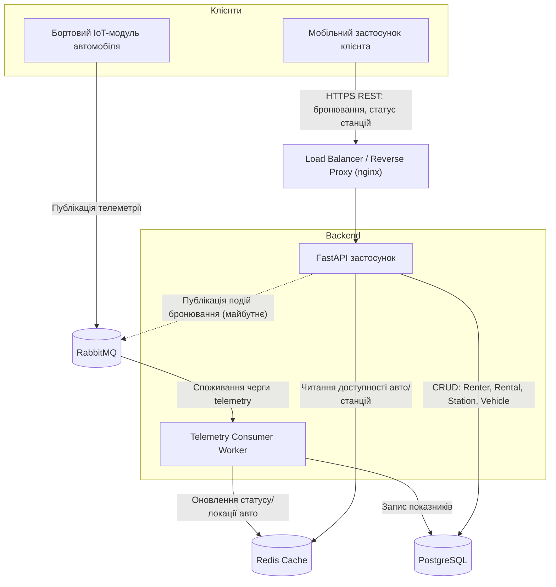

# Fleet Management System (Каршерінг)

## Обґрунтування вибору предметної області

Обрана предметна область — **Fleet Management з IoT-телеметрією** (варіант №13), реалізована на прикладі **станційного каршерінгу**: компанія володіє парком автомобілів, які клієнти орендують на короткий термін, забираючи та повертаючи авто на фіксованих станціях.

Цей напрямок цікавий поєднанням реального бізнес-кейсу (сервіси на кшталт станційного каршерінгу) з технічно складним навантаженням — безперервним потоком телеметрії від автомобілів і конкурентним доступом до обмеженої кількості авто/місць на популярних станціях, що дає простір для практики роботи з чергами повідомлень та подієво-керованою архітектурою.

### Ключові сутності

- **Vehicle** — автомобіль парку: держномер, модель, статус (available / rented / maintenance), поточна станція.
- **Station** — фіксована станція видачі/повернення: адреса, місткість, кількість вільних місць.
- **Renter** — клієнт, що орендує авто: ім'я, номер посвідчення, історія оренд.
- **Rental** — оренда/бронювання: клієнт, авто, станція старту та фінішу, час початку/кінця, статус.
- **TelemetryReading** — показник телеметрії з датчиків авто: координати, рівень пального/заряду, статус замка, часова мітка.

### Сценарій навантаження

1. **Безперервний потік телеметрії**: кожен автомобіль парку регулярно надсилає координати, рівень пального/заряду та статус замка. Ці дані йдуть через **RabbitMQ**, щоб згладити пікове навантаження запису в базу даних і не блокувати основний API.
2. **Конкурентний доступ (race condition)**: у пікові години кілька клієнтів можуть одночасно намагатися забронювати останнє вільне авто на популярній станції — це вимагає коректної обробки конкурентних транзакцій при створенні `Rental`.

## Архітектура системи



### Компоненти та потоки даних

1. **Клієнти:**
   - *Мобільний застосунок* — клієнт каршерінгу: пошук вільних авто на станціях, бронювання, оренда.
   - *Бортовий IoT-модуль* — вбудований в кожен автомобіль пристрій, що постійно публікує телеметрію (координати, рівень пального/заряду, статус замка).

2. **Load Balancer / Reverse Proxy** — розподіляє вхідні HTTP-запити між кількома інстансами FastAPI-застосунку, забезпечуючи горизонтальне масштабування бекенду під пікове навантаження (наприклад, ранкові години пік бронювань).

3. **Backend (FastAPI застосунок)** — обробляє REST-запити клієнтів: реєстрація/автентифікація, пошук доступних авто, створення `Rental`. Створення оренди виконується в межах транзакції БД з блокуванням рядка (`SELECT ... FOR UPDATE`) на записі `Vehicle`/`Station`, щоб уникнути подвійного бронювання одного авто кількома клієнтами одночасно.

4. **RabbitMQ (Message Broker)** — приймає безперервний потік повідомлень телеметрії від тисяч бортових модулів, згладжуючи пікові сплески запису і розв'язуючи публікацію даних (сенсори) зі споживанням (Worker) у часі.

5. **Telemetry Consumer Worker** — окремий процес, що споживає чергу телеметрії з RabbitMQ, зберігає історичні показники в PostgreSQL та оновлює "гарячий" стан (поточна локація/статус авто) у Redis-кеші.

6. **Redis Cache** — зберігає часто запитувані, швидкозмінні дані (поточна доступність авто на станції, останні координати), щоб API не звертався до PostgreSQL при кожному запиті пошуку авто.

7. **PostgreSQL** — основне реляційне сховище сутностей `Vehicle`, `Station`, `Renter`, `Rental` та історії `TelemetryReading`.

## Статичний аналіз якості коду (SonarQube)

Локальний SonarQube Community Edition піднімається через Docker Compose:

```powershell
docker compose -f config/docker-compose.yml up -d sonarqube
```

Дашборд: http://localhost:9000 (проєкт `fleet-management`).

Токен сканера генерується один раз у `http://localhost:9000/account/security`.

Запуск сканування (вручну, коли потрібно перевірити поточний стан коду):

```powershell
docker run --rm `
    -e SONAR_HOST_URL="http://host.docker.internal:9000" `
    -e SONAR_TOKEN="<твій токен>" `
    -v "${PWD}:/usr/src" `
    -w /usr/src `
    sonarsource/sonar-scanner-cli
```

Результат — у Quality Gate на дашборді проєкту.

### Quality Gate: критерії та обґрунтування

Проєкту прив'язано кастомний профіль `Fleet Management Custom Gate` (відмінний від стандартного `Sonar way`), з 4 обов'язковими критеріями:

| # | Критерій | Категорія | Поріг |
|---|---|---|---|
| 1 | New Bugs | New Code, Reliability | = 0 |
| 2 | New Security Hotspots Reviewed | New Code, Security | = 100% |
| 3 | Duplicated Lines % | Overall Code, Duplication | ≤ 3% |
| 4 | Maintainability Rating | Overall Code, Maintainability | = A |

Архітектурне обґрунтування (під стек FastAPI + async SQLAlchemy + PostgreSQL):

1. **New Bugs = 0** — async I/O (await/coroutines, спільний стан по кількох воркерах) — типове джерело нових багів (unawaited coroutine, race condition). Блокує їх на вході, а не після мержу.
2. **New Security Hotspots Reviewed = 100%** — застосунок ходить у PostgreSQL напряму (`text()` для raw SQL вже є в `main.py`) — SQL injection головний ризик. Кожен hotspot має пройти ручний рев'ю перед мержем.
3. **Duplicated Lines % ≤ 3%** — шарова CRUD-архітектура (models/schemas/services/api на кожну сутність: Vehicle, Station, Renter, Rental) природньо тягне copy-paste між сутностями. Ліміт стримує це змасштабуванням проєкту.
4. **Maintainability Rating = A** — бізнес-правила живуть у `services/` (розрахунок вартості оренди, перевірка доступності авто/місця, право на оренду). Саме такі функції найшвидше обростають вкладеними умовами під нові edge-cases. Первісно критерій був заданий як `Cognitive Complexity (Overall) ≤ 15`, але ця метрика — сира сума складності по всьому проєкту, тому механічно росте з кожним новим (навіть простим) методом і не відображає реальну якість. Замінено на `Maintainability Rating = A` — нормалізований показник (співвідношення технічного боргу до розміру коду), а per-method ліміт ≤15 і далі контролює правило аналізатора `S3776`.

### Завд.4: рефакторинг найгірших методів (Maintainability / Technical Debt)

Ідентифіковано через звіт аналізатора (правило `S3776`, сортування по `sqale_index`) два методи з найгіршими показниками:

| Метод | Файл | Cognitive Complexity (До → Після) | Technical Debt (До → Після) |
|---|---|---|---|
| `validate_rental_eligibility` | `services/rental_service.py` | **58 → 8** (критичний рівень) | 48 хв → 0 |
| `rentals_summary` | `api/rentals.py` | **19 → ~4** | 9 хв → 0 |

Після рефакторингу: 0 залишкових порушень `S3776`, `code_smells` та `sqale_index` (Technical Debt) проєкту повернулись до рівня Baseline.

**Застосовані техніки:**
- **Guard Clauses** — у `validate_rental_eligibility` прибрано 4 рівні вкладеного `if/else`, кожна умова виходу тепер на верхньому рівні.
- **Extract Variable** — повторювана умова "потрібна застава на вихідних" рахувалась двічі в різних гілках; винесена в одну змінну `deposit_missing`.
- **Делегування сервісу замість дублювання** — `rentals_summary` дублював формулу розрахунку вартості з `calculate_cost`; замінено прямим викликом сервісу (усунуто і складність, і порушення шарової архітектури).
- **Extract Method через `Counter`** — ручний цикл з `if/elif` для підрахунку оренд за статусами замінено на `collections.Counter`.

Всі рефакторинги верифіковано на еквівалентність поведінки: `validate_rental_eligibility` — 1152 комбінації вхідних параметрів, `calculate_cost`-делегування — 1000 значень тривалості, розбіжностей 0.

**Git-історія кейсу (До/Після для Code Review):**
- `1cb64a7` — навмисно нерефакторений код (До)
- `b0063cf` — рефакторинг (Після)

**Порівняльна таблиця станів проєкту (Завд.3 + Завд.4):**

| Показник | Baseline | Failed (Завд.3) | Fixed (Завд.3) | Fixed (Завд.4) |
|---|---|---|---|---|
| Bugs | 0 | 0 | 0 | 0 |
| Code Smells | 6 | 8 | 6 | 6 |
| Duplicated Lines % | 0.0% | 13.6% | 0.0% | 0.0% |
| Technical Debt (sqale_index) | 30 хв | — | 30 хв | 30 хв |
| Quality Gate | PASS | **FAIL** | PASS | PASS |