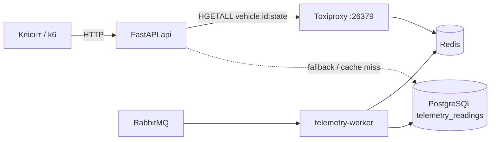

# Лабораторна робота №2 — ISO/IEC 25010 Performance Efficiency та Resilience Engineering

Повний цикл роботи:
`SLO → k6 load test → PASS/FAIL → Toxiproxy fault injection → 500/timeout «до» → Retry + Fallback → pytest resilience tests → Graceful Degradation «після»`

---

## 1. Характеристика об'єкта дослідження

### 1.1. Сервіс і технологічний стек

| Компонент | Технологія |
|---|---|
| API | Python 3.13, FastAPI 0.141, Uvicorn 0.52 (1 процес) |
| База даних | PostgreSQL 16 (SQLAlchemy 2 async + asyncpg) |
| Кеш «гарячого» стану | Redis 7 (redis-py 8.1) |
| Брокер телеметрії | RabbitMQ 4 + сервіс `telemetry-worker` |
| Fault injection | Toxiproxy 2.12.0 (`ghcr.io/shopify/toxiproxy`) |
| Навантажувальне тестування | **Grafana k6 v1.3.0** (Docker-образ `grafana/k6:1.3.0`) |
| Автотести | pytest 9.1 + pytest-asyncio 1.4 + httpx 0.28 |

Локальний запуск усієї системи однією командою: `docker compose up -d --build --wait`.

### 1.2. Обраний ендпоінт: `GET /vehicles/{id}/state`

**Призначення.** Повертає поточний стан авто: координати, рівень пального, чи зачинене. Мобільний застосунок викликає цей ендпоінт щоразу, коли клієнт відкриває картку авто на карті або оновлює її перед бронюванням. Це найчастіша операція системи, і клієнт бачить її напряму. Якщо вона повільна або падає, клієнт не може вибрати авто.

**Типовий запит і відповідь:**

```http
GET /vehicles/5/state HTTP/1.1

HTTP/1.1 200 OK
{"vehicle_id":5,"recorded_at":"2026-09-26T12:26:03.274153Z","latitude":49.8405,
 "longitude":24.0305,"fuel_level":45.0,"is_locked":true,"source":"cache","degraded":false}
```

| Поле | Значення |
|---|---|
| `source` | `cache` — дані з Redis; `database` — останній запис із Postgres |
| `degraded` | `true`, якщо відповідь є fallback через збій залежності |

**Залежності, що впливають на час виконання:**



1. **Redis** — основне джерело (гарячий кеш, який пише `telemetry-worker`). У нормальному режимі запит читає тільки Redis і взагалі не звертається до Postgres.
2. **PostgreSQL** — джерело істини (таблиця `telemetry_readings`). Використовується при cache miss і як **fallback**.
3. **CPU процесу API** — серіалізація JSON, валідація Pydantic, event loop (див. аналіз вузького місця).

### 1.3. Зовнішня залежність для дослідження стійкості — Redis

| | Нормальна взаємодія | Очікувана поведінка при недоступності |
|---|---|---|
| Що робить API | Один `HGETALL vehicle:{id}:state`, ~1 мс | Не висіти, не падати з 500, віддати останній відомий стан із Postgres з позначкою `degraded: true` |
| Якщо даних немає і в Postgres | — | Контрольований `503 Service Unavailable` + `Retry-After: 5` |

---

## 2. Завдання 1. Performance Testing та валідація SLO

### 2.1. Код сценарію та команда запуску

Сценарій: [`loadtest/vehicle_state.js`](../loadtest/vehicle_state.js). Сід даних: [`scripts/seed_loadtest.py`](../scripts/seed_loadtest.py). Сід створює станцію і 50 авто через API, а потім публікує телеметрію в RabbitMQ, тож дані в Redis і Postgres потрапляють тим самим шляхом, що й реальна телеметрія.

```powershell
python scripts/seed_loadtest.py
docker compose run --rm --no-deps k6 run /scripts/vehicle_state.js -e PROFILE=normal
docker compose run --rm --no-deps k6 run /scripts/vehicle_state.js -e PROFILE=peak
```

Ключовий фрагмент (автоматичні критерії прийнятності):

```js
const SLO = {
  normal: { p95: 100, errorRate: 0.01 },
  peak: { p95: 100, errorRate: 0.01 },
  fault: { p95: 1000, errorRate: 0.01 },
};
export const options = {
  scenarios: { [PROFILE]: PROFILES[PROFILE] },
  thresholds: {
    http_req_duration: [`p(95)<${Number(__ENV.P95_MS || slo.p95)}`],
    http_req_failed: [`rate<${Number(__ENV.MAX_ERROR_RATE || slo.errorRate)}`],
  },
  summaryTrendStats: ['avg', 'med', 'p(90)', 'p(95)', 'p(99)', 'max'],
};
```

PASS/FAIL визначає сам інструмент: якщо порушено будь-який threshold, k6 друкує `✗` і завершується з **exit code 99**, а при успіху повертає код 0. Рахувати щось вручну не треба.

### 2.2. Модель навантаження

Використано **відкриту модель** (`ramping-arrival-rate`): k6 генерує запити із заданою частотою незалежно від того, як швидко відповідає сервіс. Так поводяться реальні клієнти: люди відкривають застосунок, не чекаючи, поки сервер «звільниться». У закритій моделі (фіксовані VU в циклі) повільний сервер автоматично зменшує навантаження на себе і приховує деградацію.

| Параметр | Normal | Peak |
|---|---|---|
| Ramp-up | 10 → 50 RPS за 20 с | 50 → 1500 RPS за 30 с |
| Плато | 50 RPS, 60 с | 1500 RPS, 60 с |
| Ramp-down | 10 с | 10 с |
| Разом | 90 с | 100 с |
| VU (pre-allocated / max) | 20 / 100 | 200 / 1000 |
| Тестові дані | 50 авто `LT-0001…LT-0050`, id обирається випадково на кожен запит | те саме |
| HTTP timeout запиту | 10 с | 10 с |

**Звідки 50 RPS (нормальне навантаження).** Модель міста: ~3000 одночасних активних сесій увечері. Застосунок оновлює стан вибраного авто в середньому раз на хвилину: 3000 / 60 ≈ **50 RPS**.

**Звідки 1500 RPS (підвищене навантаження).** Це ×30 від норми: масова подія (концерт або матч) плюс push-розсилка з акцією, коли всі одночасно відкривають карту і застосунок опитує стан кожні 2 с. Число свідомо обрано вище за виміряну пропускну здатність (див. нижче), щоб знайти межу системи.

### 2.3. Обґрунтування thresholds

**p95 < 100 мс.**
- За моделлю RAIL відгук до 100 мс сприймається як миттєвий. Мобільна мережа сама додає 50–150 мс, тому серверна частина не має перевищувати ~100 мс, щоб картка авто відкривалась «без паузи».
- Базове вимірювання (прогін normal) дало **p95 = 4,1 мс**. Запас ×25 покриває відмінності продакшену: більший обсяг даних, реальна мережа, паралельний потік запису телеметрії. Водночас поріг ловить деградацію на порядок, а саме так і виглядає перевантаження (p95 зростає до секунд).
- Обрано p95, а не max: поодинокі викиди (GC, перше з'єднання) не повинні ламати SLO. Але 1 запит із 20 — це вже систематичний досвід користувача (див. п. 2.6).

**Error Rate < 1%.**
- Операція тільки читає дані й ідемпотентна, а застосунок періодично оновлює стан. Тож поодинока помилка непомітна: наступне оновлення її «виправить».
- Якщо помилок більше 1%, значить, кожен сотий запит падає системно, і користувач регулярно бачить помилку на екрані. Це відповідає цілі успішності 99% для операції.
- Базове вимірювання дало 0% помилок.

**Деградований режим (профіль `fault`): p95 < 1000 мс, Error Rate < 1%.** Під час збою Redis допускається сповільнення, але не відмови. Найгірший час механізму стійкості становить 750 мс (розрахунок у п. 3.4), плюс кілька мілісекунд на запит у Postgres. 1 с — межа, за якої користувач ще не втрачає нитку дій (правило Нільсена 0,1 / 1 / 10 с).

### 2.4. Результати прогонів

Сирі результати: [`loadtest/results/`](../loadtest/results) (`*.txt` — консольний вивід k6, `*.json` — `--summary-export`).

**Normal — PASS** (exit code 0):

```
  █ THRESHOLDS
    http_req_duration
    ✓ 'p(95)<100' p(95)=4.1ms
    http_req_failed
    ✓ 'rate<0.01' rate=0.00%

    http_req_duration..............: avg=2.38ms med=2.21ms p(90)=3.14ms p(95)=4.1ms  p(99)=4.75ms max=5.67ms
    http_req_failed................: 0.00%  0 out of 3850
    http_reqs......................: 3850   42.777329/s
```

**Peak — FAIL** (exit code 99):

```
  █ THRESHOLDS
    http_req_duration
    ✗ 'p(95)<100' p(95)=1.18s
    http_req_failed
    ✓ 'rate<0.01' rate=0.00%

    http_req_duration..............: avg=835.1ms  med=998.1ms  p(90)=1.13s p(95)=1.18s p(99)=1.31s max=4.55s
    http_req_failed................: 0.00%  0 out of 84316
    http_reqs......................: 84316  843.138702/s
    dropped_iterations.............: 36434  364.330797/s
    vus_max........................: 1000   min=200        max=1000
level=error msg="thresholds on metrics 'http_req_duration' have been crossed"
```

| Метрика | Normal (50 RPS) | Peak (1500 RPS) |
|---|---|---|
| p90, мс | 3.14 | 1130 |
| **p95, мс** | **4.10** ✓ | **1180** ✗ |
| p99, мс | 4.75 | 1310 |
| avg, мс | 2.38 | 835.1 |
| Throughput, RPS (середнє за прогін) | 42.8 (плато 50) | 843.1 (при запланованих 1500) |
| **Error Rate** | **0.00%** ✓ | **0.00%** ✓ |
| Не надіслані запити (`dropped_iterations`) | 0 | 36 434 |
| Результат | **PASS** | **FAIL** |

Додатковий прогін для пошуку межі (`-e PEAK_RPS=600`) пройшов PASS: p95 = 4.13 мс, p99 = 23.4 мс, max = 260 мс при 487 RPS. При `PEAK_RPS=2000` пропускна здатність вийшла на плато **~910 RPS**.

### 2.5. Аналіз причини FAIL та вузького місця

**Яка метрика спричинила FAIL:** `http_req_duration p(95)`, що дорівнює 1.18 с при порозі 100 мс, тобто перевищення у 12 разів. Error Rate лишився 0%: сервіс не падав, він **ставав у чергу**.

**Де вузьке місце.** Завантаження контейнерів у момент плато (`docker stats`):

| Контейнер | CPU |
|---|---|
| **api** | **95.4%** |
| k6 | 32.3% |
| toxiproxy | 11.5% |
| redis | 5.2% |
| db (Postgres) | 0.01% |

API впирається в **одне ядро CPU** (95% ≈ 1 ядро з 12 доступних). Uvicorn запущено одним процесом (`CMD ... uvicorn ... --port 8000` без `--workers`), а Python-код, тобто розбір запиту, валідація Pydantic і серіалізація JSON, через GIL виконується в одному потоці. Redis і Postgres мають великий запас: у нормальному режимі Postgres взагалі не бере участі в запиті.

**Механіка деградації.** Пропускна здатність одного процесу становить ~850–910 RPS. Коли запити надходять швидше (1500 RPS), надлишок стає в чергу event loop. За законом Літтла L = λ·W: при ~1000 запитів у польоті і ~850 RPS обслуговування очікування становить W ≈ 1000 / 850 ≈ 1.2 с, що збігається з виміряним p95 = 1.18 с. Коли всі 1000 VU зайняті очікуванням, k6 уже не може надіслати нові запити, і вони потрапляють у `dropped_iterations` (36 434). Зверніть увагу: ці відмови **не видно в `http_req_failed`**, бо запити навіть не були відправлені. Саме тому поріг на латентність є обов'язковим, а одного Error Rate недостатньо.

**Як усунути:** кілька процесів (`uvicorn --workers N` або gunicorn з N воркерами) чи горизонтальне масштабування реплік `api` за балансувальником. Postgres і Redis при цьому не є обмеженням.

### 2.6. Чому середній час відповіді не може замінити p95/p99

Розподіл часу відповіді асиметричний: більшість запитів швидкі, а «хвіст» довгий. Середнє змішує обидві частини і вводить в оману в обидва боки. Приклади з наших вимірювань:

1. **Середнє приховує хвіст.** Прогін 600 RPS: avg = 2.73 мс виглядає ідеально, але p99 = 23.4 мс (у 8,5 раза більше), а max = 260 мс. Кожен сотий користувач чекає в 8 разів довше, ніж каже середнє.
2. **Середнє применшує проблему, коли є швидкі помилки.** Прогін `fault` «до» (п. 3.3): avg = 3.46 с, хоча медіана і p95 = **5.0 с**. Середнє «покращили» миттєві відмови (`Connection refused`, `Too many connections`, ~1 мс). Отже, що більше сервіс падає, то кращим стає його середній час.
3. **Сценарій користувача складається з багатьох запитів.** Якщо за сесію клієнт робить 20 запитів, імовірність, що хоча б один потрапить у найгірші 5%, дорівнює 1 − 0.95²⁰ ≈ 64%. Тобто p95 описує досвід більшості користувачів, а не рідкісний виняток.
4. **SLO формулюється як обіцянка:** «95% запитів швидші за 100 мс». Середнє такої гарантії не дає: avg = 50 мс сумісний і з «усі по 50 мс», і з «90% по 5 мс та 10% по 455 мс».

---

## 3. Завдання 2. Fault Injection та обробка відмов

### 3.1. Спосіб симуляції відмови (Toxiproxy)

Між `api` і Redis стоїть TCP-проксі **Toxiproxy** ([`loadtest/toxiproxy.json`](../loadtest/toxiproxy.json)). API підключається до `redis://toxiproxy:26379`, а `telemetry-worker` пише в Redis напряму. Збої вмикаються через HTTP API Toxiproxy скриптом [`scripts/fault.py`](../scripts/fault.py). **Жоден контейнер не зупиняється**, ламається тільки мережевий зв'язок API → Redis.

| Команда | Що симулює | Toxic |
|---|---|---|
| `python scripts/fault.py latency 3000` | Перевантажений Redis: кожна відповідь затримується на 3 с | `latency` |
| `python scripts/fault.py timeout` | Redis «завис»: TCP-з'єднання відкрите, але відповідей немає | `timeout`, `timeout=0` |
| `python scripts/fault.py down` | Redis недоступний: connection refused | proxy `enabled=false` |
| `python scripts/fault.py reset` | Зняти всі збої | `POST /reset` |
| `python scripts/fault.py status` | Показати активні збої | — |

**Відтворюваність:** кожна команда спочатку викликає `reset`, а потім додає рівно один toxic, тому стан однаковий за будь-якої послідовності команд. Режим «до» та «після» перемикається змінною `RESILIENCE_ENABLED` без перезбирання образу.

### 3.2. Код «До» та «Після»

**До** (`RESILIENCE_ENABLED=false`): клієнт із налаштуваннями бібліотеки за замовчуванням (socket timeout 5 с) і прямий виклик без обробки помилок.

```python
# src/fleet_management/cache.py
Redis.from_url(settings.redis_url, decode_responses=True)

# src/fleet_management/services/vehicle_state_service.py
cached = await redis.hgetall(key)          # немає retry, немає fallback: будь-який збій -> 500
```

**Після** (`RESILIENCE_ENABLED=true`, за замовчуванням):

```python
# src/fleet_management/cache.py — власний timeout, вбудовані в драйвер retry вимкнені
Redis.from_url(
    settings.redis_url,
    decode_responses=True,
    socket_timeout=timeout,
    socket_connect_timeout=timeout,
    retry=Retry(NoBackoff(), 0),   # єдиний шар retry — наш, інакше кількість викликів множиться
)

# src/fleet_management/services/vehicle_state_service.py
try:
    cached = await call_with_retry(
        lambda: redis.hgetall(key),
        policy,
        retry_on=REDIS_TRANSIENT_ERRORS,     # лише ConnectionError / TimeoutError
        name="redis.hgetall",
    )
except RetryExhaustedError as exc:
    logger.error("Redis unavailable for vehicle %d after %d attempts (%r); "
                 "serving degraded state from Postgres", vehicle_id, exc.attempts, exc.last_error)
    reading = await latest_reading(db, vehicle_id)
    if reading is None:
        raise DependencyUnavailableError(...)   # -> 503 + Retry-After: 5
    return _from_reading(reading, degraded=True)
```

```python
# src/fleet_management/resilience.py — ядро механізму
async def call_with_retry(operation, policy, *, retry_on, name, sleep=asyncio.sleep, rand=random.random):
    for attempt in range(1, policy.max_attempts + 1):
        try:
            return await asyncio.wait_for(operation(), timeout=policy.attempt_timeout)
        except (TimeoutError, *retry_on) as exc:
            logger.warning("%s failed on attempt %d/%d: %r", name, attempt, policy.max_attempts, exc)
            if attempt == policy.max_attempts:
                raise RetryExhaustedError(name, attempt, exc) from exc
            await sleep(policy.backoff_delay(attempt, rand))
```

Повний diff: `git diff main -- src/`.

### 3.3. Базова поведінка «До» та результат «Після»

**Одиночні запити** (`curl -w "%{http_code} %{time_total}"`, авто id=5):

| Збій | «До»: статус / час | «Після»: статус / час / тіло |
|---|---|---|
| немає | 200 / ~6 мс, `source=cache` | 200 / ~6 мс, `source=cache` |
| `latency 3000` | 200 / **12.03 с** (кожен round-trip при встановленні з'єднання +3 с) | 200 / **0.71 с**, `source=database, degraded=true` |
| `timeout` | **500 Internal Server Error / 5.01 с** | 200 / **0.76 с**, `degraded=true` |
| `down` | **500 Internal Server Error / 0.008 с** | 200 / **0.15 с**, `degraded=true` |

**Логи «До»** (`docker compose logs api`): необроблений виняток і traceback:

```
ERROR:    Exception in ASGI application
redis.exceptions.TimeoutError: Timeout reading from toxiproxy:26379
INFO:     172.20.0.1:51834 - "GET /vehicles/5/state HTTP/1.1" 500 Internal Server Error
ConnectionRefusedError: [Errno 111] Connection refused
redis.exceptions.ConnectionError: Error 111 connecting to toxiproxy:26379. Connection refused.
```

**Під навантаженням** (профіль `fault`: 30 RPS × 40 с, увімкнено toxic `timeout`):

```
--- ДО (RESILIENCE_ENABLED=false) — FAIL, exit 99
    ✗ 'p(95)<1000' p(95)=5.01s
    ✗ 'rate<0.01' rate=99.91%
    http_req_duration..: avg=3.46s med=5s p(90)=5.01s p(95)=5.01s p(99)=5.01s max=5.02s
    http_req_failed....: 99.91% 1150 out of 1151
    http_reqs..........: 1151   25.562947/s
    dropped_iterations.: 51
  логи api:  797 x redis.exceptions.TimeoutError: Timeout reading from toxiproxy:26379
             353 x redis.exceptions.MaxConnectionsError: Too many connections

--- ПІСЛЯ (RESILIENCE_ENABLED=true) — PASS, exit 0
    ✓ 'p(95)<1000' p(95)=743.62ms
    ✓ 'rate<0.01' rate=0.00%
    degraded_responses.: 100.00% 1200 out of 1200
    http_req_duration..: avg=716.43ms med=717.14ms p(90)=739.75ms p(95)=743.62ms p(99)=749.87ms max=767.73ms
    http_req_failed....: 0.00%   0 out of 1201
    http_reqs..........: 1201   29.488074/s
  логи api:  1200 x "redis.hgetall failed on attempt 1/3", 1200 x "... 2/3", 1200 x "... 3/3"
             1200 x "ERROR ... Redis unavailable for vehicle N after 3 attempts (TimeoutError()); serving degraded state from Postgres"
             0 x "Too many connections"
```

**Каскадний ефект «До».** Кожен запит тримав з'єднання з Redis 5 с. За 30 RPS це ~150 одночасно завислих з'єднань, і пул redis-py вичерпався. Тоді 353 запити впали вже не через Redis, а з помилкою `Too many connections`, миттєво. Тобто збій залежності перетворився на вичерпання власних ресурсів сервісу. «Після» кожне з'єднання звільняється через 200 мс, тож пул не переповнюється.

### 3.4. Параметри механізму та їх обґрунтування

Параметри винесено в конфігурацію (`src/fleet_management/config.py`, env-змінні):

| Параметр | Значення | Обґрунтування |
|---|---|---|
| `RESILIENCE_ENABLED` | `true` | `false` відтворює базову поведінку «До» |
| `REDIS_ATTEMPT_TIMEOUT_MS` | 200 | Здоровий Redis відповідає за ~1 мс (p99 усього запиту 4.75 мс). Якщо відповіді немає за 200 мс (×40 від норми), залежність «хвора», а не просто повільна. |
| `REDIS_RETRY_MAX_ATTEMPTS` | 3 | 1 виклик + 2 повтори: достатньо, щоб пережити короткий збій (тест `test_single_redis_blip_is_absorbed_by_retry`), і при цьому найгірший час не виходить за 1 с. |
| `REDIS_RETRY_BASE_DELAY_MS` | 50 | Пауза після 1-ї спроби 25–50 мс, після 2-ї 50–100 мс (експоненційне подвоєння). |
| `REDIS_RETRY_MAX_DELAY_MS` | 400 | Стеля паузи, щоб експонента не росла необмежено при збільшенні `max_attempts`. |
| Jitter | equal jitter | Пауза = половина експоненти + випадкова частка другої половини. |

**Найгірший час до fallback:** 3 × 200 мс (таймаути) + 50 мс + 100 мс (паузи) = **750 мс**. Це гарантовано кодом (`RetryPolicy.worst_case_seconds`, тест `test_worst_case_time_is_bounded`) і підтверджено виміром: p99 = 749.87 мс під навантаженням.

**Retry лише для тимчасових помилок:** `ConnectionError`, `TimeoutError`. Помилка в коді (`ValueError`) не повторюється, бо повтор нічого не змінить (тест `test_non_transient_error_is_not_retried`).

**Fallback:** Postgres є джерелом істини, куди `telemetry-worker` пише той самий запис, що й у Redis. Тому fallback-відповідь не «заглушка», а реальний останній стан авто, просто отриманий повільнішим шляхом. Прапорець `degraded: true` дозволяє клієнту показати «дані можуть бути неактуальні». Якщо даних немає й у Postgres, API повертає контрольований **503 + `Retry-After: 5`** замість 500.

### 3.5. Як уникнуто retry storm

**Retry storm** виникає, коли клієнти у відповідь на збій залежності починають надсилати їй ще більше запитів. Кожен повтор додає навантаження саме тоді, коли залежність і так не справляється. Наслідки:
- **Множення трафіку:** при нескінченних повторах без паузи кожен запит перетворюється на безкінечний потік викликів. 30 RPS від клієнтів можуть стати тисячами RPS на Redis, і перевантажений Redis уже ніколи не відновиться.
- **Синхронні хвилі:** якщо всі клієнти повторюють через однаковий інтервал, їхні повтори приходять одночасно пачками (thundering herd).
- **Вичерпання власних ресурсів:** кожен запит, що чекає на повтор, тримає з'єднання, пам'ять і воркер. Саме це ми бачили в режимі «До» (`Too many connections`).
- **Мультиплікація шарів:** retry в драйвері × retry в сервісі × retry у клієнта дають N³ викликів.

**Що зроблено:**
1. **Обмежена кількість спроб:** максимум 3, валідується (`max_attempts >= 1`).
2. **Обмежений час кожної спроби:** 200 мс (`asyncio.wait_for` + `socket_timeout`), тобто завислий виклик не тримає ресурси.
3. **Експоненційний backoff:** 50 → 100 мс, стеля 400 мс. Кожен наступний повтор чекає довше і дає залежності час відновитися.
4. **Jitter:** рознесення повторів у часі, щоб вони не приходили синхронною хвилею.
5. **Один шар retry:** вбудований retry драйвера redis-py вимкнено (`Retry(NoBackoff(), 0)`).
6. **Fallback замість повторів «до перемоги»:** після 3 спроб запит іде в Postgres, а не повторюється далі.
7. **`Retry-After: 5` у 503:** клієнт отримує явну вказівку, коли повторювати.

Підсумкове навантаження на хворий Redis: максимум ×3 від вхідного трафіку і лише протягом ≤750 мс на запит. Подальший крок, який тут не реалізовано, — **circuit breaker**: після серії відмов він на кілька секунд одразу віддає fallback без звернення до Redis, і тоді навіть ці 3 спроби не генеруються.

---

## 4. Завдання 3. Автоматизована верифікація стійкості

### 4.1. Test doubles

| Double | Файл | Що моделює |
|---|---|---|
| `FakeRedis(state, failures=N)` | `tests/unit/test_vehicle_state_service.py` | Перші N викликів `hgetall` кидають `redis.exceptions.ConnectionError`, далі повертають `state` |
| `DownRedis` | `tests/integration/test_vehicle_state_api.py` | Redis, що відмовляє на кожному виклику, підставляється через `app.dependency_overrides[get_redis]` |
| `RecordingSleep` | обидва unit-файли | Замість `asyncio.sleep` записує тривалість пауз, тож тест не чекає реального часу |
| `rand=lambda: 1.0` | обидва unit-файли | Фіксований jitter, щоб затримки були точно передбачувані |
| `FakeLatestReading` | `tests/unit/test_vehicle_state_service.py` | Підміна запиту до Postgres, що рахує, чи активувався fallback |
| `FlakyOperation`, `hangs_forever` | `tests/unit/test_resilience.py` | Тимчасові збої та операція, що зависає назавжди (для перевірки timeout) |

Тести **не залежать від реального Redis**: відмова відтворюється детерміновано, без мережі і без випадкових затримок.

### 4.2. Позитивна перевірка (fallback не активується)

```python
async def test_healthy_redis_serves_cache_and_fallback_is_not_used(monkeypatch, sleep):
    db = use_db_reading(monkeypatch, DB_READING)
    redis = FakeRedis(state=CACHED_STATE)

    state = await get_state(redis, sleep)

    assert state.model_dump(mode="json") == {
        "vehicle_id": VEHICLE_ID, "recorded_at": "2026-09-26T10:00:00Z",
        "latitude": 49.8397, "longitude": 24.0297, "fuel_level": 72.5,
        "is_locked": True, "source": "cache", "degraded": False,
    }
    assert redis.calls == 1          # без повторів
    assert sleep.delays == []        # без пауз
    assert db.calls == 0             # fallback НЕ викликався
```

### 4.3. Resilience test (конкретна очікувана поведінка)

```python
async def test_redis_outage_degrades_gracefully_to_postgres(monkeypatch, sleep, caplog):
    db = use_db_reading(monkeypatch, DB_READING)
    redis = FakeRedis(state=CACHED_STATE, failures=100)

    with caplog.at_level(logging.WARNING):
        state = await get_state(redis, sleep)

    assert state.model_dump(mode="json") == {             # fallback-body
        "vehicle_id": VEHICLE_ID, "recorded_at": "2026-09-26T09:55:00Z",
        "latitude": 49.8, "longitude": 24.0, "fuel_level": 60.0,
        "is_locked": False, "source": "database", "degraded": True,
    }
    assert redis.calls == POLICY.max_attempts == 3        # кількість спроб
    assert sleep.delays == pytest.approx([0.05, 0.1])     # експоненційний backoff
    assert db.calls == 1
    retry_warnings = [r for r in caplog.records if r.name == "fleet_management.resilience"]
    assert len(retry_warnings) == 3                       # діагностика кожної спроби
    fallback_logs = [r for r in caplog.records if r.name == "fleet_management.vehicle_state"]
    assert fallback_logs[0].levelno == logging.ERROR
    assert "serving degraded state from Postgres" in fallback_logs[0].getMessage()
```

HTTP-рівень (`tests/integration/test_vehicle_state_api.py`):

```python
async def test_redis_outage_without_fallback_data_returns_503(client, vehicle_id):
    redis = DownRedis()
    use_redis(redis)

    response = await client.get(f"/vehicles/{vehicle_id}/state")

    assert response.status_code == 503                     # контрольований статус
    assert response.headers["Retry-After"] == "5"
    assert response.json() == {"detail": f"State of vehicle {vehicle_id} is temporarily unavailable"}
    assert redis.calls == 3
```

**Повний перелік (20 тестів):**

| Файл | Тест | Що перевіряє |
|---|---|---|
| `test_resilience.py` | `test_backoff_doubles_per_attempt_and_is_capped` | 50/100/200/400/400 мс |
| | `test_jitter_keeps_at_least_half_of_the_exponential_delay` | межі jitter |
| | `test_worst_case_time_is_bounded` | найгірший час = 750 мс |
| | `test_policy_rejects_unbounded_or_meaningless_values` ×2 | заборона `max_attempts=0`, `timeout=0` |
| | `test_success_on_first_attempt_does_not_retry` | 1 виклик, 0 пауз |
| | `test_transient_failure_is_retried_after_backoff` | 2 виклики, пауза 50 мс |
| | `test_gives_up_after_max_attempts_with_backoff_between_them` | 3 виклики, паузи [50, 100], 3 точні лог-повідомлення |
| | `test_hanging_call_is_cut_by_attempt_timeout_and_retried` | завислий виклик обривається timeout'ом |
| | `test_non_transient_error_is_not_retried` | баг не повторюється |
| `test_vehicle_state_service.py` | `test_healthy_redis_serves_cache_and_fallback_is_not_used` | позитивний сценарій |
| | `test_single_redis_blip_is_absorbed_by_retry` | короткий збій маскується повтором, fallback не потрібен |
| | `test_redis_outage_degrades_gracefully_to_postgres` | **graceful degradation** |
| | `test_redis_outage_without_fallback_data_is_a_controlled_error` | `DependencyUnavailableError` |
| | `test_cache_miss_reads_postgres_without_degraded_flag` | cache miss ≠ degraded |
| | `test_unknown_vehicle_is_not_found` | 404 |
| | `test_baseline_without_policy_lets_redis_failure_escape` | фіксує поведінку «До» |
| `test_vehicle_state_api.py` | `test_state_is_served_from_redis_cache` | HTTP 200 із реального Redis (db 15) |
| | `test_redis_outage_returns_degraded_state_from_postgres` | HTTP 200 + точне fallback-body, 3 спроби |
| | `test_redis_outage_without_fallback_data_returns_503` | HTTP 503 + `Retry-After` |

### 4.4. Детермінованість: три послідовні запуски

```
> for ($i=1; $i -le 3; $i++) { pytest tests/unit/test_resilience.py tests/unit/test_vehicle_state_service.py tests/integration/test_vehicle_state_api.py -p no:cacheprovider }
=== run 1
============================= 20 passed in 0.82s ==============================
=== run 2
============================= 20 passed in 0.84s ==============================
=== run 3
============================= 20 passed in 0.89s ==============================
```

Стабільність забезпечено дизайном: `sleep` і `rand` інжектуються, тому відсутні реальні таймінги і випадковість. Збій моделює детермінований fake, а не мережа. Єдиний тест на реальному часі (`hanging_call`) перевіряє timeout 10 мс на операції, яка **ніколи** не завершується, тож результат від швидкості машини не залежить.

### 4.5. Інтеграція в стандартний test/build процес

- Локально: `pytest` (з кореня, `testpaths = ["tests"]` у `pyproject.toml`). Повний набір **76 passed**.
- CI (`.github/workflows/ci.yml`, job `Build & Test (api)`): нові файли додано до кроку `Test (api)`, тож вони запускаються на кожен PR і push у `main`.

---

## 5. Підсумкова таблиця станів системи

| Показник якості | Початковий / нормальний стан | Контрольована деградація (збій Redis, захист вимкнено) | Стан після реалізації захисту (той самий збій) |
|---|---|---|---|
| p95 response time, мс | 4.1 | 5010 | 743.6 |
| p99 response time, мс | 4.75 | 5010 | 749.9 |
| Error Rate, % | 0.00 | 99.91 | 0.00 |
| Throughput / RPS | 42.8 (плато 50) | 25.6 (з 30 запланованих) | 29.5 (з 30 запланованих) |
| Реакція на збій залежності | Нормальна відповідь (`source=cache`) | Timeout 5 с → HTTP 500, traceback, `Too many connections` | Fallback із Postgres (`degraded=true`), HTTP 200; без даних → 503 + `Retry-After` |
| Кількість retry-спроб | 0 | 0 | 3 (1 + 2 повтори, backoff 50/100 мс) |
| Результат автоматичної перевірки | **PASS** (k6 exit 0) | **FAIL** (k6 exit 99) | **PASS** (k6 exit 0; pytest 20/20 ×3) |

Для повноти: під навантаженням peak (1500 RPS) без збою результат **FAIL**, p95 = 1180 мс, Error Rate 0%, 843 RPS. Причина — CPU одного процесу API.

## 6. Висновок щодо відповідності ISO/IEC 25010

**Performance Efficiency.**
- *Time behaviour:* за нормального навантаження (50 RPS) операція з великим запасом відповідає SLO: p95 = 4.1 мс при порозі 100 мс, 0% помилок.
- *Capacity:* виміряна межа ~850–910 RPS на один процес API. При 1500 RPS SLO порушується за латентністю (p95 = 1.18 с), але не за помилками. Обмеження — CPU одного процесу Uvicorn, а не Redis чи Postgres. Отже, щоб розширити capacity, треба масштабувати кількість процесів або реплік API.
- *Resource utilization:* у нормальному режимі операція не навантажує Postgres, бо читає лише кеш.

**Reliability.**
- *Fault tolerance:* збій Redis (затримка, зависання, відмова з'єднання) більше не призводить до 500 чи довгого очікування. Сервіс віддає реальні дані з Postgres з позначкою `degraded`, а за їх відсутності повертає контрольований 503.
- *Availability:* під збоєм Redis Error Rate знизився з 99.91% до 0%, час відповіді обмежено ≤750 мс замість 5–12 с, каскадне вичерпання пулу з'єднань усунено.
- *Recoverability:* після `fault.py reset` наступні запити знову обслуговуються з кешу (`source=cache`), ручне втручання не потрібне.
- *Maturity (захист від регресій):* поведінку зафіксовано 20 детермінованими тестами в CI. Вони перевіряють кількість спроб, backoff, fallback-тіло, HTTP-статус і діагностичні логи.

Висновок: нефункціональні вимоги Performance Efficiency і Reliability для операції `GET /vehicles/{id}/state` переведено у **виконувану специфікацію якості**. Це k6-thresholds, які автоматично дають PASS/FAIL, і pytest-тести стійкості, які автоматично ловлять регресію механізму Retry/Fallback.

---

## 7. Інструкція з демонстрації (Live Demo, ≤ 5 хв)

Усі команди для **PowerShell** з кореня репозиторію `C:\Users\dryak\Uni\Web_Python`.

### 7.0. Підготовка ДО заняття (≈10 хв, не входить у 5 хв захисту)

1. Запустити **Docker Desktop** і дочекатися статусу *Engine running*.
2. Переключитися на гілку і підняти всю систему:
   ```powershell
   git checkout feat/lab2-quality-resilience
   docker compose up -d --build --wait
   docker compose ps          # api, db, redis, rabbitmq, toxiproxy, worker — Up / healthy
   ```
3. Заповнити дані для навантаження (очікуваний вивід: `Seeded 50 vehicles ... all cached in Redis`):
   ```powershell
   python scripts/seed_loadtest.py
   ```
4. Підняти тестові Postgres і Redis для pytest. Вони не конфліктують зі стеком, бо його `db` і `redis` не публікують порти 5432/6379 назовні:
   ```powershell
   docker run -d --name lab2-test-pg -e POSTGRES_USER=fleet_user -e POSTGRES_PASSWORD=fleet_password -e POSTGRES_DB=fleet_management_test -p 5432:5432 postgres:16
   docker run -d --name lab2-test-redis -p 6379:6379 redis:7-alpine
   .venv\Scripts\Activate.ps1
   pytest -q                  # очікувано: 76 passed
   ```
5. Прогріти образ k6 і перевірити, що збоїв немає:
   ```powershell
   docker compose run --rm --no-deps k6 version
   python scripts/fault.py reset
   ```
6. Відкрити в IDE вкладки: `loadtest/vehicle_state.js` (блоки `SLO`/`thresholds`), `src/fleet_management/resilience.py`, `src/fleet_management/services/vehicle_state_service.py`, `src/fleet_management/config.py`, `tests/unit/test_vehicle_state_service.py`, `docs/lab2-report.md` (таблиця з розділу 5).
7. Відкрити **три вікна PowerShell**: (A) для команд, (B) для логів `docker compose logs -f api`, (C) запасне.
8. **Страховка:** у `loadtest/results/` вже лежать повні результати прогонів normal/peak/fault_before/fault_after. Якщо живий прогін зависне, покажіть їх.

### 7.1. Крок 1 — Performance SLO Validation (~1.5 хв)

1. В IDE показати `loadtest/vehicle_state.js`: профілі `normal`/`peak` і пороги **`p(95)<100`** та **`rate<0.01`**. Одним реченням пояснити: «p95 — бо avg ховає хвіст; 100 мс — межа миттєвого відгуку, базове вимірювання показало 4 мс; 1% — операція ідемпотентна, клієнт сам оновлює стан».
2. Прогін **PASS** (≈45 с):
   ```powershell
   docker compose run --rm --no-deps k6 run /scripts/vehicle_state.js -e PROFILE=normal -e STEADY=15s
   echo "exit code: $LASTEXITCODE"      # 0
   ```
   Показати `✓ 'p(95)<100'`, `✓ 'rate<0.01'` і рядок `http_req_duration` з p90/p95/p99.
3. Прогін **FAIL** (≈55 с):
   ```powershell
   docker compose run --rm --no-deps k6 run /scripts/vehicle_state.js -e PROFILE=peak -e STEADY=15s
   echo "exit code: $LASTEXITCODE"      # 99
   ```
   Показати `✗ 'p(95)<100' p(95)=~1.1s`, `dropped_iterations` і фінальне `thresholds ... have been crossed`. Пояснити, що причина — CPU одного процесу API (95%), а Redis і Postgres майже простоюють.
   *Швидша альтернатива FAIL (змінити threshold замість навантаження):*
   `docker compose run --rm --no-deps k6 run /scripts/vehicle_state.js -e PROFILE=normal -e STEADY=5s -e P95_MS=2`

### 7.2. Крок 2 — Fault Injection & Resilience Demo (~2 хв)

У вікні **B** має працювати `docker compose logs -f --tail 0 api`.

**«До» (захист вимкнено):**
```powershell
$env:RESILIENCE_ENABLED = "false"
docker compose up -d --wait api
python scripts/fault.py timeout                                    # Redis "завис"
curl.exe -s -w "`nHTTP %{http_code} in %{time_total}s`n" http://localhost:8000/vehicles/5/state
#  -> Internal Server Error / HTTP 500 in ~5.0s ; у вікні B: traceback redis.exceptions.TimeoutError
python scripts/fault.py down                                       # Redis недоступний
curl.exe -s -w "`nHTTP %{http_code} in %{time_total}s`n" http://localhost:8000/vehicles/5/state
#  -> HTTP 500 ; у вікні B: ConnectionRefusedError / redis.exceptions.ConnectionError
```
*(опційно, +45 с)* під навантаженням: `python scripts/fault.py timeout`, а потім
`docker compose run --rm --no-deps k6 run /scripts/vehicle_state.js -e PROFILE=fault -e STEADY=20s`
дає **FAIL**, `rate=~99%`, `p95=5s`, а в логах `Too many connections` (каскад).

**«Після» (захист увімкнено), той самий збій:**
```powershell
Remove-Item Env:RESILIENCE_ENABLED
docker compose up -d --wait api
python scripts/fault.py timeout
curl.exe -s -w "`nHTTP %{http_code} in %{time_total}s`n" http://localhost:8000/vehicles/5/state
#  -> {"...","source":"database","degraded":true}  HTTP 200 in ~0.75s
#  у вікні B: 3 x WARNING "redis.hgetall failed on attempt N/3" + ERROR "... serving degraded state from Postgres"
python scripts/fault.py down
curl.exe -s -w "`nHTTP %{http_code} in %{time_total}s`n" http://localhost:8000/vehicles/5/state
#  -> HTTP 200 in ~0.15s, degraded=true
```
*(опційно, +45 с)* `docker compose run --rm --no-deps k6 run /scripts/vehicle_state.js -e PROFILE=fault -e STEADY=20s` дає **PASS**, `rate=0.00%`, `degraded_responses 100%`.

**Відновлення:**
```powershell
python scripts/fault.py reset
curl.exe -s http://localhost:8000/vehicles/5/state        # source=cache, degraded=false
```

> ⚠️ Команди k6 запускати **з `--no-deps`**. Інакше `docker compose run` перестворить контейнер `api` з налаштувань compose і мовчки поверне `RESILIENCE_ENABLED=true`.

### 7.3. Крок 3 — Code Review & Automated Resilience Test (~1.5 хв)

1. В IDE показати:
   - `config.py`: параметри 200 мс / 3 спроби / 50 мс / 400 мс та коментарі з обґрунтуванням;
   - `resilience.py`: `call_with_retry` (обмежений цикл, `wait_for`, retry тільки для тимчасових помилок), `backoff_delay` (експонента + jitter), `worst_case_seconds`;
   - `vehicle_state_service.py`: `except RetryExhaustedError`, лог ERROR, fallback у Postgres і 503.
2. Показати тест `test_redis_outage_degrades_gracefully_to_postgres`: `FakeRedis(failures=100)` → перевірки тіла, `redis.calls == 3`, `sleep.delays == [0.05, 0.1]`, логів.
3. Запустити тести тричі поспіль:
   ```powershell
   for ($i=1; $i -le 3; $i++) { "=== run $i"; pytest tests/unit/test_resilience.py tests/unit/test_vehicle_state_service.py tests/integration/test_vehicle_state_api.py -p no:cacheprovider -q }
   ```
   Очікувано: тричі `20 passed`.
4. *(Опційно)* Показати, що тести в CI: `.github/workflows/ci.yml`, крок `Test (api)`.

### 7.4. Після захисту

```powershell
python scripts/fault.py reset
docker rm -f lab2-test-pg lab2-test-redis
docker compose down            # додати -v, щоб видалити й дані
```

### 7.5. Шпаргалка до запитань (штрафні пункти!)

**Чим avg відрізняється від p95/p99?**
avg — середнє арифметичне всіх запитів, p95 — значення, швидше за яке 95% запитів. Розподіл асиметричний, тому avg ховає хвіст: при 600 RPS avg = 2.7 мс, а p99 = 23 мс. Швидкі помилки ще й «покращують» avg: у режимі «До» avg = 3.46 с, а p95 = 5 с. SLO — це обіцянка про досвід більшості користувачів, тому його формулюють через перцентиль.

**Як thresholds визначають PASS/FAIL?**
k6 після прогону обчислює метрику (`p(95)` з `http_req_duration`, `rate` з `http_req_failed`) і порівнює її з виразом у `options.thresholds`. Якщо хоча б один вираз хибний, k6 друкує `✗`, пише `thresholds ... have been crossed` і завершується з **exit code 99**. CI або скрипт сприймає це як FAIL без ручного аналізу.

**Що таке retry storm і чому у вас його немає?**
Retry storm — це коли повтори клієнтів множать навантаження на і так перевантажену залежність і не дають їй відновитися. Нескінченні повтори без паузи перетворюють 30 RPS на тисячі, синхронні повтори б'ють хвилями, а кожен запит, що чекає, тримає з'єднання, як наш `Too many connections` у режимі «До». У нас максимум 3 спроби, timeout 200 мс на кожну, експоненційний backoff 50 → 100 мс зі стелею 400 мс, jitter, retry драйвера вимкнено (один шар), після 3 спроб fallback, для 503 є `Retry-After`. Найгірше навантаження на Redis — ×3 і лише протягом ≤750 мс на запит.

**Чому саме 200 мс / 3 спроби?**
Здоровий Redis відповідає за ~1 мс, тож 200 мс — явна ознака збою. 3 спроби переживають короткий збій, а в найгіршому випадку дають 750 мс < 1 с (SLO деградованого режиму).

**Чому fallback — Postgres, а не статична заглушка?**
Worker пише той самий запис і в Redis, і в Postgres, тож дані реальні й актуальні. Прапорець `degraded` чесно повідомляє клієнту про деградований режим.

**Де вузьке місце при peak?**
CPU одного процесу Uvicorn (95% одного ядра; через GIL один процес Python не використовує інші ядра). Redis зайнятий на 5%, Postgres на ≈0%. Рішення — `--workers N` або кілька реплік API.
