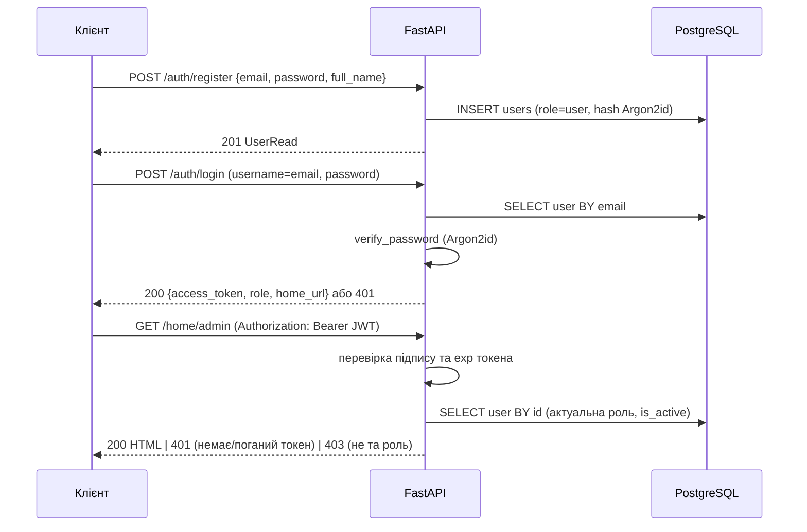

# Лабораторна робота №2 (Web): користувачі, ролі, розмежування доступу

Гілка: `feat/lab2-web-auth`. Проєкт: Fleet Management (каршерінг), FastAPI + PostgreSQL.

## Що зроблено (основне завдання)

| № | Пункт завдання | Реалізація |
|---|----------------|------------|
| 1 | Модифікувати попередній проєкт | Нові модулі вбудовані в наявну структуру `src/fleet_management/` (models / services / api), наявні ендпоінти не змінені |
| 2 | База даних користувачів | Таблиця `users` (модель `models/user.py`), міграція Alembic `b7e4a1c2d3f5_add_users.py` |
| 3 | Ролі (мін. 2) | `UserRole`: `admin`, `user` (enum у PostgreSQL) |
| 4 | Реєстрація звичайних користувачів | `POST /auth/register` — завжди створює роль `user` |
| 4* | Реєстрація адміністраторів (опційно) | Перший адмін — консольна команда `create-admin`; наступних створює адмін через `POST /admin/admins` |
| 5 | Вхід для різних типів користувачів | `POST /auth/login` (OAuth2 password flow) → JWT + `role` + `home_url` |
| 6 | Домашні сторінки-заглушки | `GET /home/user` (кабінет орендаря), `GET /home/admin` (адмін-панель) — HTML |
| 7 | Код у репозиторії + обґрунтування | Цей документ |

Додатково: `GET /auth/me` (поточний користувач), `GET /admin/users` (список користувачів, тільки адмін).

## Схема таблиці `users`

| Поле | Тип | Примітка |
|------|-----|----------|
| `id` | integer PK | |
| `email` | varchar(254), unique index | логін; нормалізується до нижнього регістру |
| `hashed_password` | varchar(255) | тільки хеш Argon2id, пароль не зберігається |
| `full_name` | varchar(150) | |
| `role` | enum `userrole` (`ADMIN`, `USER`) | |
| `is_active` | boolean | деактивований користувач втрачає доступ одразу |
| `created_at` | timestamptz, `now()` | |

## Потік автентифікації



## Обґрунтування архітектурних рішень

**JWT Bearer замість серверних сесій.** Проєкт — REST API (FastAPI), а не сайт із шаблонами; клієнтами можуть бути мобільний застосунок орендаря і веб-адмінка. Stateless-токен не потребує сховища сесій, однаково працює за кількома репліками `api` і вбудовано підтримується Swagger UI (кнопка *Authorize* веде на `/auth/login`). Час життя токена — 30 хв (`ACCESS_TOKEN_EXPIRE_MINUTES`).

**Роль перевіряється за базою, а не за claim у токені.** Токен містить лише `sub` (id) і `exp`; на кожен запит користувач читається з БД за первинним ключем. Ціна — один дешевий SELECT; виграш — зняття ролі або деактивація діє миттєво, а не після закінчення строку токена.

**401 vs 403.** Немає токена, токен підроблений/прострочений, користувач деактивований → `401 Unauthorized` із заголовком `WWW-Authenticate: Bearer`. Користувач відомий, але роль не підходить → `403 Forbidden`. Це розмежовує «хто ти?» і «що тобі можна?».

**Перевірка ролей як залежність FastAPI.** `require_roles(...)` (`auth.py`) — одна фабрика залежностей для всіх маршрутів. Для `/admin` вона навішена на весь роутер, тож новий адмінський маршрут не можна випадково залишити відкритим.

**Хешування Argon2id (pwdlib).** Переможець Password Hashing Competition, memory-hard — перебір злитого хешу на GPU дорогий. Кожен хеш має власну сіль.

**Захист від перебору логінів.** Для неіснуючого email і для неправильного пароля повертається однакова відповідь `401 "Incorrect email or password"`, а для неіснуючого email все одно виконується перевірка фіктивного хешу — час відповіді не видає, які адреси зареєстровані.

**Роль не приймається при реєстрації.** Схема `UserRegister` не містить поля `role`; навіть якщо клієнт його надішле, створюється `user`. Адміністратора не можна «зареєструвати» ззовні: перший створюється з консолі сервера (`create-admin`, пароль з `ADMIN_PASSWORD` або інтерактивно, не з аргументів командного рядка), наступних — лише інший адмін.

**Унікальність email гарантує БД.** Унікальний індекс + обробка `IntegrityError` → `409 Conflict`. Попередня перевірка `SELECT` не захистила б від двох одночасних реєстрацій.

**Секрет підпису поза репозиторієм.** `JWT_SECRET_KEY` береться з `.env` (не комітиться); без нього API не стартує, а `docker compose` зупиняється з підказкою. Алгоритм у `jwt.decode` зафіксований (`HS256`) — токени з `alg: none` або іншим алгоритмом відкидаються.

**Домашні сторінки — HTML без шаблонізатора.** Це заглушки, тому достатньо `HTMLResponse`; усі дані користувача екрануються (`html.escape`) — захист від stored XSS через `full_name`. Після логіну клієнт отримує `home_url` своєї ролі.

**Наявні ендпоінти предметної області не закриті.** `/stations`, `/vehicles`, `/rentals` поки публічні: на них спираються навантажувальні тести k6 з попередньої лабораторної. Прив'язка оренд до користувача і захист від IDOR — предмет додаткового завдання.

## Як запустити й перевірити

```bash
# 1. Згенерувати секрет і додати в .env
python -c "import secrets; print('JWT_SECRET_KEY=' + secrets.token_urlsafe(32))" >> .env

# 2. Підняти стек (міграція users застосується при старті api)
docker compose up -d --build

# 3. Створити першого адміністратора
docker compose exec -e ADMIN_PASSWORD=adminpass123 api create-admin --email admin@example.com --full-name "Fleet Admin"

# 4. Зареєструвати звичайного користувача і увійти
curl -X POST localhost:8000/auth/register -H "Content-Type: application/json" \
  -d '{"email":"ivan@example.com","password":"ivanpass123","full_name":"Ivan"}'
curl -X POST localhost:8000/auth/login -d "username=ivan@example.com&password=ivanpass123"

# 5. Домашня сторінка з токеном
curl -H "Authorization: Bearer <access_token>" localhost:8000/home/user
```

Або через Swagger UI: `http://localhost:8000/docs` → *Authorize*.

Очікувані коди (перевірено на живому стеку):

| Маршрут | Анонім | user | admin |
|---------|--------|------|-------|
| `GET /auth/me` | 401 | 200 | 200 |
| `GET /home/user` | 401 | 200 | 403 |
| `GET /home/admin` | 401 | 403 | 200 |
| `GET /admin/users` | 401 | 403 | 200 |

## Тести

- `tests/unit/test_security.py` — хешування, сіль, JWT: прострочений, підписаний чужим ключем, `alg: none`, без `sub`.
- `tests/integration/test_auth_api.py` — реєстрація (роль примусово `user`, дубль 409, валідація 422), вхід (200 / 401, однакова помилка), анонімний доступ 401, деактивований користувач 401, ролі 403/200, XSS-екранування.

```bash
pytest tests/unit/test_security.py tests/integration/test_auth_api.py -v
```
